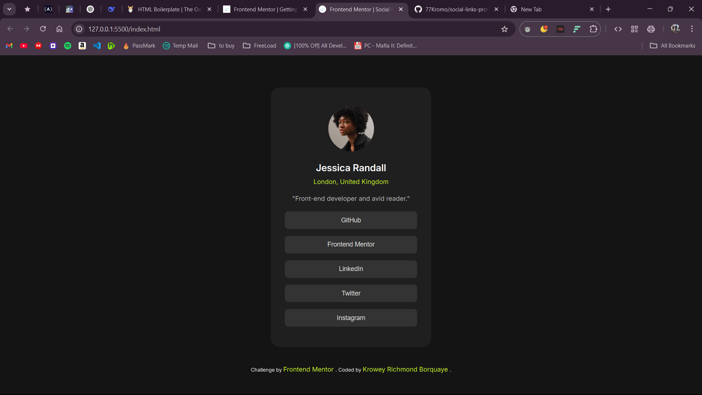

[](https://your-live-site-url.com)

A responsive social links profile card component showcasing modern CSS techniques and hover interactions.

🚀 [Live Demo](https://css-master-app-1.netlify.app/)

## Table of Contents

- [Overview](#overview)
  - [Challenge](#challenge)
  - [Features](#features)
- [Built With](#built-with)
- [What I Learned](#what-i-learned)
- [Author](#author)

## Overview

### Challenge

Users should be able to:

- View optimal layout depending on their device's screen size
- See hover states for all interactive elements

### Features

- Responsive card layout
- Interactive button hover effects
- Semantic HTML structure
- Accessible color contrast
- CSS transitions

## Built With

- Semantic HTML5
- CSS Custom Properties
- Mobile-first Workflow
- CSS Transitions

## What I Learned

### CSS Implementation

```css
/* Button styling with transitions */
.social-btn {
  display: block;
  background-color: hsl(0, 0%, 20%);
  transition: background-color 0.3s ease, color 0.3s ease;
}

.social-btn:hover {
  background-color: hsl(75, 94%, 57%);
  color: hsl(0, 0%, 12%);
}

/* Centering technique */
.social-card {
  width: 350px;
  margin: 70px auto;
}

```

### HTML Structure

```
<!-- Semantic card structure -->
<div class="social-card">
  
  <h1>Jessica Randall</h1>
  <p>London, United Kingdom</p>
  <!-- Interactive buttons -->
  <button class="social-btn">GitHub</button>
</div>

```

## Author

- [Frontend Mentor](https://www.frontendmentor.io/profile/77Kromo)
- [GitHub](https://github.com/77Kromo)

<sub>Solution by Krowey Richmond Borquaye</sub>